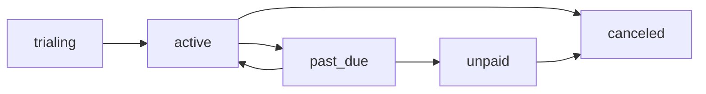

The Subscriptions API manages user subscriptions through Polar (payment provider). It handles subscription lifecycle events including creation, updates, cancellation, and reactivation.

## Data Model

<ResponseField name="_id" type="Id<'subscriptions'>" required>
  Unique identifier for the subscription
</ResponseField>

<ResponseField name="userId" type="string" required>
  Clerk user ID who owns the subscription
</ResponseField>

<ResponseField name="polarSubscriptionId" type="string" required>
  Polar's subscription identifier
</ResponseField>

<ResponseField name="customerId" type="string" required>
  Polar customer ID
</ResponseField>

<ResponseField name="productId" type="string" required>
  Polar product ID
</ResponseField>

<ResponseField name="priceId" type="string" required>
  Polar price ID
</ResponseField>

<ResponseField name="status" type="SubscriptionStatus" required>
  Subscription status: `active`, `past_due`, `canceled`, `unpaid`, or `trialing`
</ResponseField>

<ResponseField name="interval" type="SubscriptionInterval" required>
  Billing interval: `monthly` or `yearly`
</ResponseField>

<ResponseField name="currentPeriodStart" type="number" required>
  Timestamp when the current billing period started (milliseconds)
</ResponseField>

<ResponseField name="currentPeriodEnd" type="number" required>
  Timestamp when the current billing period ends (milliseconds)
</ResponseField>

<ResponseField name="cancelAtPeriodEnd" type="boolean" required>
  Whether the subscription will cancel at the end of the current period
</ResponseField>

<ResponseField name="canceledAt" type="number">
  Timestamp when the subscription was canceled (optional)
</ResponseField>

<ResponseField name="trialStart" type="number">
  Timestamp when the trial period started (optional)
</ResponseField>

<ResponseField name="trialEnd" type="number">
  Timestamp when the trial period ends (optional)
</ResponseField>

<ResponseField name="metadata" type="object">
  Additional metadata from Polar (optional)
</ResponseField>

<ResponseField name="createdAt" type="number" required>
  Timestamp when the subscription was created
</ResponseField>

<ResponseField name="updatedAt" type="number" required>
  Timestamp when the subscription was last updated
</ResponseField>

## Queries

### getSubscription

Get the active subscription for the authenticated user.

```typescript
import { api } from '@/convex/_generated/api';
import { useQuery } from 'convex/react';

const subscription = useQuery(api.subscriptions.getSubscription);

if (subscription) {
  console.log(`Plan: ${subscription.interval}`);
  console.log(`Status: ${subscription.status}`);
}
```

**Arguments:** None

**Returns:** Active subscription object or `null` if no active subscription

**Authentication:** Required

**Throws:** `"Unauthorized"`

**Note:** Only returns subscriptions with `status === "active"`. Use `getUserSubscriptions` to get all subscriptions.

---

### getSubscriptionByPolarId

Get a subscription by Polar subscription ID.

```typescript
import { api } from '@/convex/_generated/api';
import { useQuery } from 'convex/react';

const subscription = useQuery(api.subscriptions.getSubscriptionByPolarId, {
  polarSubscriptionId: "sub_...",
});
```

<ParamField path="polarSubscriptionId" type="string" required>
  The Polar subscription ID
</ParamField>

**Returns:** Subscription object or `null` if not found

**Authentication:** Not required (used internally by webhooks)

---

### getUserSubscriptions

Get all subscriptions for a specific user.

```typescript
import { api } from '@/convex/_generated/api';
import { useQuery } from 'convex/react';

const subscriptions = useQuery(api.subscriptions.getUserSubscriptions, {
  userId: "user_...",
});
```

<ParamField path="userId" type="string" required>
  The Clerk user ID
</ParamField>

**Returns:** Array of all subscriptions for the user (any status)

**Authentication:** Not required (used internally)

## Mutations

### createOrUpdateSubscription

Create a new subscription or update an existing one (idempotent).

```typescript
import { api } from '@/convex/_generated/api';
import { useMutation } from 'convex/react';

const upsertSubscription = useMutation(
  api.subscriptions.createOrUpdateSubscription
);

const subscriptionId = await upsertSubscription({
  polarSubscriptionId: "sub_...",
  customerId: "cus_...",
  productId: "prod_...",
  priceId: "price_...",
  status: "active",
  interval: "monthly",
  currentPeriodStart: Date.now(),
  currentPeriodEnd: Date.now() + 30 * 24 * 60 * 60 * 1000,
  cancelAtPeriodEnd: false,
});
```

<ParamField path="polarSubscriptionId" type="string" required>
  Polar subscription ID
</ParamField>

<ParamField path="customerId" type="string" required>
  Polar customer ID
</ParamField>

<ParamField path="productId" type="string" required>
  Polar product ID
</ParamField>

<ParamField path="priceId" type="string" required>
  Polar price ID
</ParamField>

<ParamField path="status" type="SubscriptionStatus" required>
  Subscription status: `active`, `past_due`, `canceled`, `unpaid`, or `trialing`
</ParamField>

<ParamField path="interval" type="SubscriptionInterval" required>
  Billing interval: `monthly` or `yearly`
</ParamField>

<ParamField path="currentPeriodStart" type="number" required>
  Current period start timestamp (milliseconds)
</ParamField>

<ParamField path="currentPeriodEnd" type="number" required>
  Current period end timestamp (milliseconds)
</ParamField>

<ParamField path="cancelAtPeriodEnd" type="boolean" required>
  Whether to cancel at period end
</ParamField>

<ParamField path="canceledAt" type="number">
  Cancellation timestamp (optional)
</ParamField>

<ParamField path="trialStart" type="number">
  Trial start timestamp (optional)
</ParamField>

<ParamField path="trialEnd" type="number">
  Trial end timestamp (optional)
</ParamField>

<ParamField path="metadata" type="object">
  Additional metadata (optional)
</ParamField>

<ParamField path="userId" type="string">
  Clerk user ID (optional, will be looked up from customer if not provided)
</ParamField>

**Returns:** `Id<"subscriptions">` - The subscription ID (creates new or updates existing)

**Note:** If a subscription with the same `polarSubscriptionId` exists, it will be updated. Otherwise, a new subscription is created.

**Error Handling:** Returns `null` if customer not found and `userId` not provided.

---

### markSubscriptionForCancellation

Mark a subscription to cancel at the end of the current billing period.

```typescript
import { api } from '@/convex/_generated/api';
import { useMutation } from 'convex/react';

const markForCancellation = useMutation(
  api.subscriptions.markSubscriptionForCancellation
);

const subscriptionId = await markForCancellation({
  polarSubscriptionId: "sub_...",
});
```

<ParamField path="polarSubscriptionId" type="string" required>
  The Polar subscription ID
</ParamField>

**Returns:** `Id<"subscriptions">` - The updated subscription ID

**Throws:** `"Subscription not found"`

**Note:** Sets `cancelAtPeriodEnd` to `true`. The subscription remains active until the end of the current period.

---

### reactivateSubscription

Reactivate a subscription that was marked for cancellation.

```typescript
import { api } from '@/convex/_generated/api';
import { useMutation } from 'convex/react';

const reactivate = useMutation(
  api.subscriptions.reactivateSubscription
);

const subscriptionId = await reactivate({
  polarSubscriptionId: "sub_...",
});
```

<ParamField path="polarSubscriptionId" type="string" required>
  The Polar subscription ID
</ParamField>

**Returns:** `Id<"subscriptions">` - The updated subscription ID

**Throws:** `"Subscription not found"`

**Note:** Sets `cancelAtPeriodEnd` to `false`, allowing the subscription to continue after the current period.

---

### revokeSubscription

Immediately cancel a subscription (revoke access).

```typescript
import { api } from '@/convex/_generated/api';
import { useMutation } from 'convex/react';

const revoke = useMutation(
  api.subscriptions.revokeSubscription
);

const subscriptionId = await revoke({
  polarSubscriptionId: "sub_...",
});
```

<ParamField path="polarSubscriptionId" type="string" required>
  The Polar subscription ID
</ParamField>

**Returns:** `Id<"subscriptions">` - The updated subscription ID

**Throws:** `"Subscription not found"`

**Note:** Sets `status` to `"canceled"` and `cancelAtPeriodEnd` to `false`. This immediately revokes access.

## Database Schema

The `subscriptions` table has the following indexes:

```typescript
// convex/schema.ts
subscriptions: defineTable({
  userId: v.string(),
  polarSubscriptionId: v.string(),
  customerId: v.string(),
  productId: v.string(),
  priceId: v.string(),
  status: subscriptionStatusEnum,
  interval: subscriptionIntervalEnum,
  currentPeriodStart: v.number(),
  currentPeriodEnd: v.number(),
  cancelAtPeriodEnd: v.boolean(),
  canceledAt: v.optional(v.number()),
  trialStart: v.optional(v.number()),
  trialEnd: v.optional(v.number()),
  metadata: v.optional(v.any()),
  createdAt: v.number(),
  updatedAt: v.number(),
})
  .index("by_userId", ["userId"])
  .index("by_polarSubscriptionId", ["polarSubscriptionId"])
  .index("by_customerId", ["customerId"])
  .index("by_status", ["status"])
```

## Subscription Status Flow



**Status Definitions:**

- `trialing`: Subscription is in trial period
- `active`: Subscription is active and paid
- `past_due`: Payment failed but subscription still active (grace period)
- `unpaid`: Payment failed, subscription suspended
- `canceled`: Subscription has been canceled

## Example Usage

### Display subscription status

```typescript
import { api } from '@/convex/_generated/api';
import { useQuery } from 'convex/react';

function SubscriptionStatus() {
  const subscription = useQuery(api.subscriptions.getSubscription);

  if (!subscription) {
    return <div>No active subscription</div>;
  }

  const periodEnd = new Date(subscription.currentPeriodEnd);

  return (
    <div>
      <h3>Your Subscription</h3>
      <p>Plan: {subscription.interval}</p>
      <p>Status: {subscription.status}</p>
      <p>Renews: {periodEnd.toLocaleDateString()}</p>
      {subscription.cancelAtPeriodEnd && (
        <p>Will cancel on {periodEnd.toLocaleDateString()}</p>
      )}
    </div>
  );
}
```

### Cancel subscription

```typescript
import { api } from '@/convex/_generated/api';
import { useQuery, useMutation } from 'convex/react';

function CancelSubscriptionButton() {
  const subscription = useQuery(api.subscriptions.getSubscription);
  const markForCancellation = useMutation(
    api.subscriptions.markSubscriptionForCancellation
  );

  if (!subscription) return null;

  const handleCancel = async () => {
    if (confirm('Cancel your subscription?')) {
      await markForCancellation({
        polarSubscriptionId: subscription.polarSubscriptionId,
      });
    }
  };

  if (subscription.cancelAtPeriodEnd) {
    return <div>Subscription will cancel at period end</div>;
  }

  return (
    <button onClick={handleCancel}>
      Cancel Subscription
    </button>
  );
}
```

### Reactivate subscription

```typescript
import { api } from '@/convex/_generated/api';
import { useQuery, useMutation } from 'convex/react';

function ReactivateButton() {
  const subscription = useQuery(api.subscriptions.getSubscription);
  const reactivate = useMutation(
    api.subscriptions.reactivateSubscription
  );

  if (!subscription || !subscription.cancelAtPeriodEnd) {
    return null;
  }

  const handleReactivate = async () => {
    await reactivate({
      polarSubscriptionId: subscription.polarSubscriptionId,
    });
  };

  return (
    <button onClick={handleReactivate}>
      Reactivate Subscription
    </button>
  );
}
```

## Webhook Integration

Subscriptions are primarily managed through Polar webhooks. The webhook handler at `/api/webhooks/polar/route.ts` processes events and calls these mutations:

**Webhook Event Handlers:**

- `subscription.created` → `createOrUpdateSubscription`
- `subscription.updated` → `createOrUpdateSubscription`
- `subscription.canceled` → `markSubscriptionForCancellation`
- `subscription.revoked` → `revokeSubscription`
- `subscription.active` → `reactivateSubscription`

**Example Webhook Flow:**

```typescript
// Simplified from src/app/api/webhooks/polar/route.ts
switch (eventType) {
  case "subscription.created":
  case "subscription.updated":
    await convex.mutation(api.subscriptions.createOrUpdateSubscription, {
      polarSubscriptionId: subscription.id,
      customerId: subscription.customerId,
      productId: subscription.productId,
      priceId: subscription.priceId,
      status: subscription.status,
      interval: subscription.recurringInterval,
      currentPeriodStart: new Date(subscription.currentPeriodStart).getTime(),
      currentPeriodEnd: new Date(subscription.currentPeriodEnd).getTime(),
      cancelAtPeriodEnd: subscription.cancelAtPeriodEnd,
      // ...
    });
    break;

  case "subscription.canceled":
    await convex.mutation(
      api.subscriptions.markSubscriptionForCancellation,
      { polarSubscriptionId: subscription.id }
    );
    break;
}
```

## Plan Access Helpers

The subscription system integrates with usage tracking through helper functions in `convex/helpers.ts`:

```typescript
// Check if user has Pro access
const isPro = await hasProAccess(ctx);

// Check if user has Unlimited access
const isUnlimited = await hasUnlimitedAccess(ctx);
```

These helpers check for active subscriptions and determine credit limits in the Usage API.