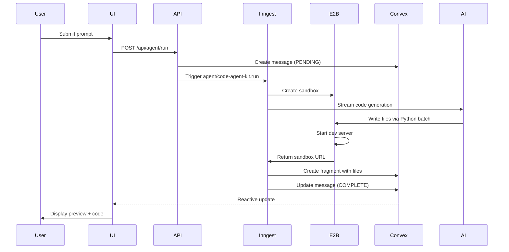
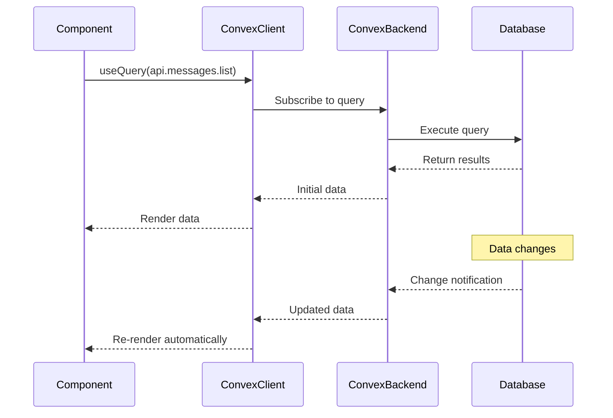

# System Architecture

ZapDev is an AI-powered web application development platform that enables users to create complete web applications through conversational AI. The system leverages a modern tech stack designed for real-time collaboration, isolated code execution, and scalable background processing.

## Architectural Overview

ZapDev follows a **hybrid architecture** combining:

- **Next.js 15 App Router** for the frontend and API layer
- **Convex** as a real-time database with reactive queries and mutations
- **E2B sandboxes** for isolated code execution environments
- **Inngest + Agent Kit** for background job orchestration
- **Convex hooks** for type-safe client-server communication

```
┌─────────────────────────────────────────────────────────────┐
│                        Client Layer                         │
│  Next.js 15 (React 19) + Tailwind CSS v4 + Shadcn/ui      │
└─────────────────┬───────────────────────────────────────────┘
                  │
                  │ Convex React Hooks (useQuery, useMutation)
                  │
┌─────────────────▼───────────────────────────────────────────┐
│                     Application Layer                       │
│  ┌──────────────┐  ┌──────────────┐                        │
│  │  App Router  │  │  API Routes  │                        │
│  │   (Pages)    │  │ (/api/*)     │                        │
│  └──────────────┘  └──────────────┘                        │
└─────────────────┬───────────────────────────────────────────┘
                  │
        ┌─────────┴──────────┐
        │                    │
┌───────▼────────┐  ┌────────▼────────┐
│  Convex Layer  │  │  Inngest Layer  │
│  (Real-time DB)│  │ (Background Jobs)│
│                │  │                 │
│  • Projects    │  │  • Agent Runs   │
│  • Messages    │  │  • Figma Import │
│  • Usage       │  │  • Error Fixing │
│  • Auth        │  │  • WebContainer │
└───────┬────────┘  └────────┬────────┘
        │                    │
        └─────────┬──────────┘
                  │
        ┌─────────▼──────────┐
        │                    │
┌───────▼────────┐  ┌────────▼────────┐
│  E2B Sandboxes │  │   External APIs │
│                │  │                 │
│  • Next.js     │  │  • Vercel AI    │
│  • Angular     │  │  • Clerk Auth   │
│  • React/Vue   │  │  • Polar Billing│
│  • Svelte      │  │  • OpenRouter   │
└────────────────┘  └─────────────────┘
```

## Core Components

### 1. Frontend Layer (Next.js 15)

**Location**: `src/app/`

The frontend uses Next.js 15's App Router with React Server Components for optimal performance:

- **App Router**: File-based routing with layouts and nested routes
- **Server Components**: Default rendering strategy for improved performance
- **Client Components**: Interactive UI elements with `'use client'` directive
- **Streaming**: Progressive UI rendering with Suspense boundaries

**Key Routes**:
- `/` - Landing page and marketing content
- `/projects/[id]` - Project workspace with split-pane interface
- `/api/*` - API routes for server-side operations

### 2. Real-Time Database (Convex)

**Location**: `convex/`

Convex provides a real-time, reactive database with automatic subscriptions:

**Core Tables** (see `convex/schema.ts:92`):
- `projects` - User projects with framework selection
- `messages` - Conversation history (USER/ASSISTANT)
- `fragments` - Generated code snapshots with sandbox URLs
- `fragmentDrafts` - In-progress code modifications
- `usage` - Credit tracking (free: 5/day, pro: 100/day)
- `subscriptions` - Polar billing integration
- `agentRuns` - Background job tracking

**Key Features**:
- **Reactive Queries**: UI automatically updates when data changes
- **Indexed Access**: All queries use indexes (no `.filter()` allowed)
- **Authentication**: Clerk JWT integration via `requireAuth(ctx)`
- **Type Safety**: Generated TypeScript types for all tables

### 3. AI Agent Orchestration

**Location**: `src/agents/` and `src/inngest/functions/`

ZapDev uses a **hybrid agent execution model**:

#### Primary Path: Custom SSE Agents
**Location**: `src/agents/code-agent.ts:1`

- Streams real-time updates via Server-Sent Events (SSE)
- Handles framework detection and model selection
- Manages E2B sandbox lifecycle
- Implements auto-fix retry logic (up to 2 attempts)

**Entry Point**: `/api/agent/run/route.ts:1`

#### Background Path: Inngest + Agent Kit
**Location**: `src/inngest/functions/`

- **code-agent.ts** - Long-running code generation workflows
- **figma-import.ts** - Figma design file processing
- **webcontainer-run.ts** - WebContainer-based execution

**Entry Point**: `/api/inngest/route.ts:1`

**Event Types** (see `src/inngest/client.ts:4`):
- `agent/code-agent-kit.run` - Full project generation
- `agent/fix-errors.run` - Build/lint error correction
- `agent/figma-import.run` - Design-to-code conversion
- `agent/code-webcontainer.run` - Browser-based execution

### 4. Isolated Code Execution (E2B)

**Location**: `sandbox-templates/`

E2B provides secure, ephemeral sandboxes for code generation:

**Supported Frameworks**:
- Next.js 15 (default)
- Angular 19 with Material Design
- React 18 with Vite + Chakra UI
- Vue 3 with Vuetify
- SvelteKit with DaisyUI

**Sandbox Features**:
- **Pre-warmed Templates**: Custom `compile_page.sh` starts dev servers before AI generation
- **Python Optimizations**: Batch file operations to reduce API latency
- **Port Mappings**: Framework-specific (Next.js=3000, Vite=5173)
- **File Operations**: `writeFilesBatch`, `readFilesBatch` for efficiency

**Template Building** (required before first use):
```bash
cd sandbox-templates/nextjs
e2b template build --name zapdev --cmd "/compile_page.sh"
```

### 5. Feature-Based Modules

**Location**: `src/modules/`

Modules are organized by feature domain with UI and server concerns:

**Module Structure**:
```
src/modules/
├── projects/
│   ├── ui/              # React components for projects
│   └── server/          # Server utilities (tRPC routers are empty)
├── messages/
│   ├── ui/              # Message components
│   └── server/
└── usage/
    ├── ui/              # Usage tracking UI
    └── server/
```

<Note>
The `server/procedures.ts` files in each module contain empty tRPC routers. All API operations use Convex directly via `convex/` functions.
</Note>

### 6. Authentication & Authorization (Clerk)

**Integration Points**:
- **Frontend**: `@clerk/nextjs` for sign-in/sign-up flows
- **Backend**: `@clerk/backend` for JWT verification
- **Convex**: Token-based auth via `convex/auth.config.ts:1`

**Auth Flow**:
1. User authenticates with Clerk
2. Clerk issues JWT token
3. Token passed to Convex via `ConvexProviderWithClerk`
4. Server validates token using `requireAuth(ctx)`

### 7. Subscription Management (Polar)

**Location**: `convex/polar.ts`, `convex/subscriptions.ts`

**Features**:
- Webhook handling for subscription events
- Customer portal integration
- Usage tier management (free/pro/unlimited)

**Credit System** (see `convex/usage.ts:1`):
- Free tier: 5 generations/day
- Pro tier: 100 generations/day
- 24-hour rolling window

## Data Flow Patterns

### Code Generation Flow



### Real-Time Updates Flow



## Design Patterns

### Feature-Based Modules

Each feature is organized in a self-contained module:

```
src/modules/[feature]/
├── ui/
│   ├── components/  # Feature-specific UI
│   ├── views/       # Page-level components
│   └── hooks/       # Custom React hooks
└── server/
    └── procedures.ts # tRPC API endpoints
```

**Benefits**:
- Co-location of related code
- Clear boundaries between features
- Easy to understand and modify

### Optimistic Updates

Convex enables optimistic UI updates for instant feedback:

```typescript
const mutation = useMutation(api.messages.create);

await mutation({
  optimisticUpdate: (localStore, args) => {
    // Update UI immediately
    localStore.setQuery(api.messages.list, {}, (old) => [...old, args]);
  },
});
```

### Python-Optimized Sandbox Operations

Batch file operations reduce API latency:

```python
# Instead of N API calls
for file in files:
    sandbox.files.write(file.path, file.content)  # Slow

# Use Python script for 1 API call
await writeFilesBatch(sandbox, files)  # Fast
```

### Framework Detection

Automatic framework selection via AI:

**Location**: `src/prompts/framework-selector.ts`

1. User describes project in natural language
2. Gemini analyzes requirements
3. Selects optimal framework (default: Next.js)
4. Loads framework-specific prompts and templates

## Security Considerations

### Input Validation

- **Zod Schemas**: All API inputs validated with Zod
- **Path Sanitization**: File paths sanitized to prevent traversal
- **NULL Byte Removal**: `sanitizeAnyForDatabase()` prevents database errors

### Sandbox Isolation

- **E2B Sandboxes**: Complete isolation from host system
- **Resource Limits**: CPU, memory, and network constraints
- **Ephemeral**: Destroyed after generation completes

### Authentication

- **JWT Tokens**: Clerk-issued tokens verified on every request
- **Rate Limiting**: Per-user rate limits in Convex
- **CORS**: Strict origin policies on API routes

## Performance Optimizations

### Database Queries

- **Indexes**: All Convex queries use indexes (see `convex/schema.ts:101`)
- **Pagination**: Messages and projects use cursor-based pagination
- **Selective Fields**: Only fetch required fields

### Frontend

- **Code Splitting**: Automatic route-based splitting
- **Server Components**: Reduce client-side JavaScript
- **Streaming**: Progressive rendering with Suspense
- **Image Optimization**: Next.js Image component with lazy loading

### Build Pipeline

- **Turbopack**: Next.js 15's faster bundler (`--turbopack` flag)
- **Bun**: Fast package manager and runtime
- **Type Checking**: Incremental builds with TypeScript

## Monitoring & Observability

### Error Tracking

**Sentry Integration** (see `package.json:55`):
- Frontend error boundaries
- API route error capture
- Source maps for stack traces

### Performance Monitoring

**Vercel Speed Insights** (see `package.json:63`):
- Web Vitals tracking
- Real user monitoring
- Performance regression alerts

### Development Tools

- **Inngest Dev UI**: http://localhost:8288 (when running `inngest-cli dev`)
- **Convex Dashboard**: Real-time database inspection
- **E2B Logs**: Sandbox execution logs

## Deployment Architecture

### Vercel (Production)

- **Frontend**: Next.js app deployed to Vercel Edge Network
- **API Routes**: Serverless functions in Vercel
- **Environment**: Production environment variables

### External Services

- **Convex Cloud**: Hosted database and backend functions
- **E2B Cloud**: Sandbox execution infrastructure
- **Inngest Cloud**: Background job orchestration
- **Clerk**: Authentication service
- **Polar**: Subscription billing

### Database Migrations

Convex uses automatic schema migrations:

```bash
bun run convex:dev      # Development
bun run convex:deploy   # Production
```

## Scalability Considerations

### Horizontal Scaling

- **Serverless Functions**: Auto-scale with traffic
- **Convex**: Automatically handles concurrent queries
- **E2B Sandboxes**: On-demand provisioning

### Resource Management

- **Credit System**: Prevents abuse via usage limits
- **Sandbox Cleanup**: Automatic destruction after use
- **Rate Limiting**: Per-user request throttling

### Caching Strategy

- **React Query**: Client-side cache (1-minute stale time)
- **Convex**: Automatic query result caching
- **CDN**: Static assets via Vercel Edge Network

## Migration History

### Prisma → Convex Migration

**Status**: Complete (see `MIGRATION_STATUS.md`)

**Reasons**:
- Real-time reactivity without polling
- Simplified deployment (no database provisioning)
- Built-in authentication integration
- Better TypeScript experience

**Key Changes**:
- Replaced Prisma Client with Convex API
- Converted SQL migrations to Convex schema
- Updated all database queries to use indexes
- Migrated file storage to Convex file storage

## References

- [Next.js 15 Documentation](https://nextjs.org/docs)
- [Convex Documentation](https://docs.convex.dev)
- [E2B Documentation](https://e2b.dev/docs)
- [Inngest Documentation](https://www.inngest.com/docs)
- [tRPC Documentation](https://trpc.io/docs)
- [Clerk Documentation](https://clerk.com/docs)
