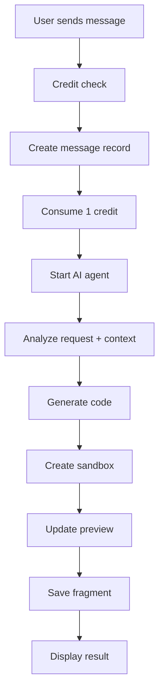

## Overview

ZapDev's conversational interface allows you to iteratively build and improve your application through natural language. Each message you send triggers an AI agent that understands context, generates code, and provides interactive previews.

## How AI Chat Works

The AI chat operates in a continuous conversation loop:

1. **You send a message** describing changes or new features
2. **AI agent processes** your request with full project context
3. **Code is generated** in isolated sandbox environments
4. **Preview updates** in real-time with the new changes
5. **Iterate** based on the results

## Sending Messages

<Steps>
  <Step title="Open Your Project">
    Navigate to any existing project to access the message interface at the bottom of the screen.
  </Step>
  
  <Step title="Compose Your Message">
    In the message textarea, describe what you want to add or change:
    
    **Good examples:**
    ```
    Add a dark mode toggle to the navbar
    ```
    
    ```
    Create a user profile page with avatar upload
    ```
    
    ```
    Fix the responsive layout on mobile devices
    ```
  </Step>
  
  <Step title="Enhance Your Prompt (Optional)">
    Click the sparkles ✨ icon to automatically enhance your prompt with AI:
    
    **Before:**
    ```
    Add a contact form
    ```
    
    **After enhancement:**
    ```
    Create a responsive contact form with fields for name, email, subject,
    and message. Include client-side validation, loading states, and a
    success notification upon submission. Use modern form design patterns
    with clear error messaging.
    ```
  </Step>
  
  <Step title="Add Visual Context (Optional)">
    Attach images to provide visual guidance:
    
    - Click the **image icon** to upload screenshots or mockups
    - Add multiple images per message
    - AI analyzes images to understand design requirements
  </Step>
  
  <Step title="Submit Message">
    Press **Cmd+Enter** (Mac) or **Ctrl+Enter** (Windows) to send.
    
    The AI agent will:
    - Analyze your request
    - Review existing project code
    - Generate necessary changes
    - Update the live preview
  </Step>
</Steps>

## Message Types

ZapDev handles different types of requests:

### Feature Additions

Add new functionality to your application:

```
Add authentication with email/password login
```

```
Implement a shopping cart with add/remove items
```

### Modifications

Update existing features or styling:

```
Change the primary color scheme to blue and orange
```

```
Make the header sticky on scroll
```

### Bug Fixes

Address issues in the generated code:

```
Fix the form validation - email field isn't validating properly
```

```
Resolve the layout overflow on small screens
```

### Refactoring

Improve code quality or architecture:

```
Extract the user card component into a reusable component
```

```
Move API calls to a separate service layer
```

## AI Model Selection

Choose different AI models based on your task complexity:

<Tabs>
  <Tab title="Auto (Recommended)">
    Automatically selects the best model for your specific request.
    
    **Best for:** Most tasks, hands-off approach
  </Tab>
  
  <Tab title="Claude Haiku 4.5">
    Fast and efficient for straightforward tasks.
    
    **Best for:** Simple UI changes, quick iterations, styling updates
    
    **Speed:** ⚡⚡⚡ Very Fast
  </Tab>
  
  <Tab title="Gemini 3 Pro">
    Advanced reasoning with state-of-the-art capabilities.
    
    **Best for:** Complex logic, algorithm implementation, data processing
    
    **Speed:** ⚡⚡ Fast
  </Tab>
  
  <Tab title="GPT-5.1 Codex">
    OpenAI's flagship model for complex development.
    
    **Best for:** Full-stack features, API integrations, complex architectures
    
    **Speed:** ⚡⚡ Fast
  </Tab>
  
  <Tab title="Z-AI GLM 4.7">
    Ultra-fast inference for speed-critical tasks.
    
    **Best for:** Rapid prototyping, small changes, experimentation
    
    **Speed:** ⚡⚡⚡ Very Fast
  </Tab>
  
  <Tab title="Kimi K2.5">
    Advanced reasoning for complex development tasks.
    
    **Best for:** Multi-step features, architectural decisions, optimization
    
    **Speed:** ⚡⚡ Fast
  </Tab>
</Tabs>

## Message Workflow

Understand what happens when you send a message:



## Message Status Indicators

Messages display different states:

| Status | Indicator | Meaning |
|--------|-----------|----------|
| **Pending** | ⏳ Spinner | Message queued for processing |
| **Streaming** | 💬 Animated | AI is actively generating code |
| **Complete** | ✅ Checkmark | Code generated successfully |
| **Error** | ❌ Error icon | Generation failed |

## Conversation Context

The AI maintains context throughout your conversation:

- **Previous messages** - All prior requests and responses
- **Current code** - The complete state of your application
- **Framework** - Your selected framework and conventions
- **Attachments** - Images and imports from earlier messages

<Tip>
You can reference previous work:

"Make the contact form match the style of the hero section we created earlier"
</Tip>

## Attachments and Imports

### Image Attachments

Attach visual references to guide AI:

<Steps>
  <Step title="Click Image Icon">
    Select the image icon in the message form toolbar.
  </Step>
  
  <Step title="Upload Images">
    Choose one or more images from your device:
    - Screenshots
    - Design mockups
    - UI inspiration
    - Reference materials
  </Step>
  
  <Step title="Images Appear as Thumbnails">
    Review attached images before sending. Click X to remove any.
  </Step>
</Steps>

### Design Imports

Import from external sources:

- **Figma** - Import designs directly from Figma files
- **GitHub** - Import existing repositories

See [Importing Designs](/guides/importing-designs) for details.

## Usage and Credits

Each message consumes **1 credit** from your daily allowance:

```
Free Plan:     5 credits/day
Pro Plan:      100 credits/day  
Unlimited:     ∞ credits
```

Credits reset every 24 hours on a rolling window basis.

<Info>
The usage indicator at the top of the message form shows:
- Remaining credits
- Time until next credit resets
- Your current plan
</Info>

## Best Practices

### Write Clear Requests

<CodeGroup>
```text Good Example
Add a responsive navigation menu with dropdown for mobile,
including links to Home, About, Services, and Contact pages.
Use smooth animations for the mobile menu toggle.
```

```text Poor Example  
Add a menu
```
</CodeGroup>

### Break Down Complex Changes

<Check>
**Instead of:** "Build a complete user authentication system with profile management, password reset, email verification, and social login"

**Try:**
1. "Create a login form with email and password fields"
2. "Add password reset functionality"
3. "Implement email verification flow"
4. "Add Google OAuth integration"
</Check>

### Provide Specific Feedback

<Check>
**Instead of:** "The button doesn't look right"

**Try:** "The submit button should be larger with rounded corners and use the primary brand color #3B82F6"
</Check>

### Use Examples

<Check>
Reference specific websites or patterns:

"Create a pricing table similar to Stripe's pricing page with three tiers"
</Check>

## Troubleshooting

### Message Won't Send

- **Check credits** - Ensure you have available credits
- **Verify prompt length** - Messages must be 1-10,000 characters
- **Wait for uploads** - Let image uploads complete

### No Code Generated

- **Check error messages** - Look for specific error details
- **Simplify request** - Try breaking into smaller steps
- **Try different model** - Switch to a different AI model

### Unexpected Results

- **Add more context** - Provide additional details or examples
- **Use images** - Upload visual references
- **Iterate** - Send follow-up messages to refine

## Next Steps

- [Manage generated files](/guides/managing-files)
- [Import Figma designs](/guides/importing-designs)
- [Understand OAuth integrations](/guides/oauth-integrations)
