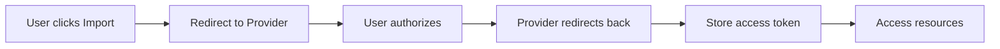
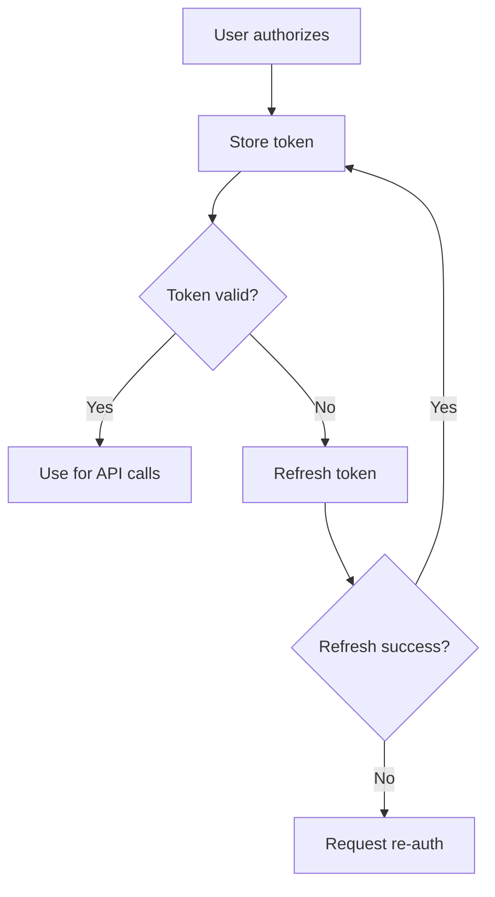

## Overview

ZapDev uses OAuth 2.0 to securely connect with external services. OAuth allows ZapDev to access your Figma designs and GitHub repositories without ever seeing your passwords.

## Supported Providers

ZapDev integrates with:

- **Figma** - Import design files and components
- **GitHub** - Import repositories and source code

## How OAuth Works

The OAuth flow in ZapDev:



<Steps>
  <Step title="User Initiates">
    You click "Import from Figma" or "Import from GitHub"
  </Step>
  
  <Step title="Redirect to Provider">
    ZapDev redirects you to the provider's authorization page
  </Step>
  
  <Step title="Grant Permission">
    You review and approve the requested permissions
  </Step>
  
  <Step title="Receive Token">
    Provider redirects back with an access token
  </Step>
  
  <Step title="Store Securely">
    ZapDev encrypts and stores the token in Convex
  </Step>
  
  <Step title="Access Resources">
    Token is used to access your files/repos on your behalf
  </Step>
</Steps>

## Setting Up Figma OAuth

Connect your Figma account to import designs.

### Authorization Process

<Steps>
  <Step title="Trigger OAuth Flow">
    From any project, click:
    1. Download icon (⬇️) in message form
    2. "Import from Figma"
    
    Or from home page when creating a new project.
  </Step>
  
  <Step title="Figma Login">
    If not logged into Figma:
    1. Enter your Figma credentials
    2. Or use Google/SSO sign-in
  </Step>
  
  <Step title="Review Permissions">
    ZapDev requests:
    
    - **File access** - Read your Figma files
    - **File metadata** - Access file names, versions, and structure
    
    These permissions allow ZapDev to:
    - Browse your Figma files
    - Read design elements and styles
    - Extract component information
    - Generate code from designs
  </Step>
  
  <Step title="Authorize">
    Click **"Allow access"** to grant permissions.
    
    You'll be redirected back to ZapDev with an active connection.
  </Step>
</Steps>

### Figma Connection Details

Once connected, ZapDev stores:

```typescript
{
  provider: "figma",
  accessToken: "figd_***",          // Encrypted token
  refreshToken: "***",              // For token renewal
  expiresAt: 1234567890,            // Token expiration
  scope: "files:read",              // Granted permissions
  metadata: {
    userId: "figma_user_123",       // Your Figma user ID
    email: "you@example.com"        // Connected email
  }
}
```

### Using Figma Connection

After authorization:

1. Browse all your Figma files
2. Select designs to import
3. ZapDev uses the token to fetch design data
4. Designs are converted to code

See [Importing Designs](/guides/importing-designs) for the full import workflow.

## Setting Up GitHub OAuth

Connect your GitHub account to import repositories.

### Authorization Process

<Steps>
  <Step title="Trigger OAuth Flow">
    From the message form:
    1. Click download icon (⬇️)
    2. Select "Import from GitHub"
  </Step>
  
  <Step title="GitHub Login">
    If not logged into GitHub:
    1. Enter GitHub username and password
    2. Complete 2FA if enabled
  </Step>
  
  <Step title="Review Permissions">
    ZapDev requests:
    
    - **Repository access** - Read repository contents
    - **Repository metadata** - Access repo names and descriptions
    
    You can choose:
    - **All repositories** - Grant access to all your repos
    - **Selected repositories** - Choose specific repos only
  </Step>
  
  <Step title="Select Repository Access">
    Choose which repositories ZapDev can access:
    
    For personal use:
    - Select specific repositories you want to import
    
    For broad access:
    - Choose "All repositories"
  </Step>
  
  <Step title="Authorize">
    Click **"Authorize ZapDev"** to grant permissions.
    
    You'll be redirected to the import page to select a repository.
  </Step>
</Steps>

### GitHub Connection Details

Stored connection data:

```typescript
{
  provider: "github",
  accessToken: "ghp_***",           // Encrypted PAT
  scope: "repo",                    // Granted scopes
  metadata: {
    login: "username",              // GitHub username
    userId: 123456,                 // GitHub user ID
    repos: ["repo1", "repo2"],      // Accessible repos
    installationId: "inst_***"      // GitHub App installation
  }
}
```

### Using GitHub Connection

After authorization:

1. View list of accessible repositories
2. Filter by organization or personal repos
3. Select repository and branch to import
4. ZapDev clones the repository contents

See [Importing Designs](/guides/importing-designs) for import details.

## Managing OAuth Connections

### Viewing Connected Accounts

Check which services are connected:

<Steps>
  <Step title="Open Settings">
    Navigate to your account settings or project settings page.
  </Step>
  
  <Step title="OAuth Connections Section">
    Find the "Connected Services" or "OAuth Connections" section.
  </Step>
  
  <Step title="View Details">
    For each connection, see:
    - Provider (Figma/GitHub)
    - Connected date
    - Granted permissions
    - Connection status
    - Last used timestamp
  </Step>
</Steps>

### Updating Permissions

To modify granted permissions:

<Warning>
Changing permissions requires re-authorization:
</Warning>

<Steps>
  <Step title="Revoke Current Connection">
    Disconnect the service from ZapDev settings.
  </Step>
  
  <Step title="Re-authorize">
    Start a new import to trigger OAuth flow again.
  </Step>
  
  <Step title="Adjust Permissions">
    On the provider's authorization page:
    - For GitHub: Change repository selection
    - For Figma: Permissions are fixed (files:read)
  </Step>
  
  <Step title="Complete Authorization">
    Authorize with new permissions.
  </Step>
</Steps>

### Revoking Connections

Disconnect a service:

<Steps>
  <Step title="Navigate to Settings">
    Open OAuth connections in your settings.
  </Step>
  
  <Step title="Select Service">
    Find Figma or GitHub in the list.
  </Step>
  
  <Step title="Click Disconnect">
    Click the **"Disconnect"** or **"Revoke"** button.
  </Step>
  
  <Step title="Confirm">
    Confirm the disconnection in the dialog.
    
    This will:
    - Delete stored access tokens
    - Prevent future imports until re-authorized
    - NOT delete previously imported content
  </Step>
</Steps>

### Revoke from Provider Side

You can also revoke access directly from the provider:

**Figma:**
1. Go to Figma Settings → Account
2. Find "Authorized applications"
3. Remove ZapDev

**GitHub:**
1. Go to GitHub Settings → Applications
2. Find "Authorized OAuth Apps"
3. Revoke ZapDev access

<Info>
Revoking from the provider side immediately invalidates tokens. You'll need to re-authorize in ZapDev for future imports.
</Info>

## Token Management

### Access Tokens

ZapDev manages tokens automatically:

- **Encryption** - All tokens encrypted in database
- **Expiration** - Tokens checked before each use
- **Refresh** - Expired tokens automatically refreshed
- **Revocation** - Invalid tokens trigger re-auth

### Token Lifecycle



### Token Scope

Each provider grants specific scopes:

**Figma:**
- `files:read` - Read access to files

**GitHub:**
- `repo` - Repository access
- `read:user` - Read user profile (optional)

<Tip>
ZapDev requests minimal necessary scopes. We never request write access unless absolutely required for a specific feature.
</Tip>

## Security Best Practices

### How ZapDev Protects Your Tokens

<Check>
**Encryption at Rest** - Tokens encrypted in Convex database using industry-standard encryption.
</Check>

<Check>
**HTTPS Only** - All OAuth flows and API calls use secure HTTPS connections.
</Check>

<Check>
**Minimal Scope** - Request only necessary permissions for core functionality.
</Check>

<Check>
**No Sharing** - Tokens never shared with third parties or other users.
</Check>

<Check>
**Automatic Expiration** - Short-lived tokens with automatic refresh.
</Check>

<Check>
**Revocable** - You can disconnect services anytime.
</Check>

### User Responsibilities

<Warning>
**Protect Your Account:**
- Use strong passwords for Figma and GitHub
- Enable 2FA on both services
- Review connected apps regularly
- Revoke unused connections
- Never share your ZapDev account
</Warning>

## Troubleshooting OAuth

### Authorization Failed

**Symptoms:** Redirect fails or shows error

**Solutions:**
- Clear browser cookies and cache
- Disable browser extensions temporarily
- Try incognito/private mode
- Use different browser
- Check if provider is down

### Token Expired

**Symptoms:** Import fails with "Unauthorized" error

**Solutions:**
- Token should auto-refresh
- If refresh fails, disconnect and re-authorize
- Check if you revoked access on provider side

### Can't Access Files/Repos

**Symptoms:** Empty file list or missing repositories

**Solutions:**
- **Figma:** Verify file ownership or sharing permissions
- **GitHub:** Check repository access scope
- Re-authorize with broader permissions
- Ensure files/repos not deleted

### Connection Shows as Inactive

**Symptoms:** Connection exists but marked inactive

**Solutions:**
- Revoke and re-authorize
- Check provider account status
- Verify email address matches
- Contact support if issue persists

## OAuth Flow Endpoints

For developers integrating with ZapDev:

### Figma OAuth

```
# Start OAuth flow
GET /api/import/figma/auth

# Callback endpoint
GET /api/import/figma/callback?code={code}

# Store connection
POST /api/oauth/figma/store
```

### GitHub OAuth

```
# Start OAuth flow  
GET /api/import/github/auth

# Callback endpoint
GET /api/import/github/callback?code={code}

# Store connection
POST /api/oauth/github/store
```

## Data Retention

### What We Store

- **Access tokens** (encrypted)
- **Refresh tokens** (encrypted)
- **Token expiration dates**
- **Granted scopes**
- **Provider user IDs**
- **Connection timestamps**

### What We Don't Store

- Your Figma/GitHub passwords
- Complete file/repo contents (only during active import)
- Unencrypted tokens
- Provider session data

### Deletion Policy

When you disconnect a service:
- Access tokens deleted immediately
- Connection records removed
- Imported content remains (orphaned)
- Re-authorization creates new connection

## API Rate Limits

ZapDev respects provider rate limits:

**Figma API:**
- 1000 requests per hour per user
- Automatic retry with backoff

**GitHub API:**
- 5000 requests per hour for authenticated users
- Cached repository data when possible

<Info>
If you hit rate limits, wait and retry. ZapDev automatically handles rate limit errors with exponential backoff.
</Info>

## Next Steps

- [Import your first Figma design](/guides/importing-designs)
- [Import a GitHub repository](/guides/importing-designs)
- [Manage your projects](/guides/creating-projects)
- [Chat with AI to refine imports](/guides/chatting-with-ai)
